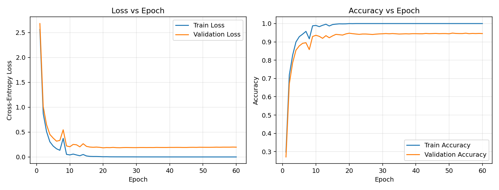
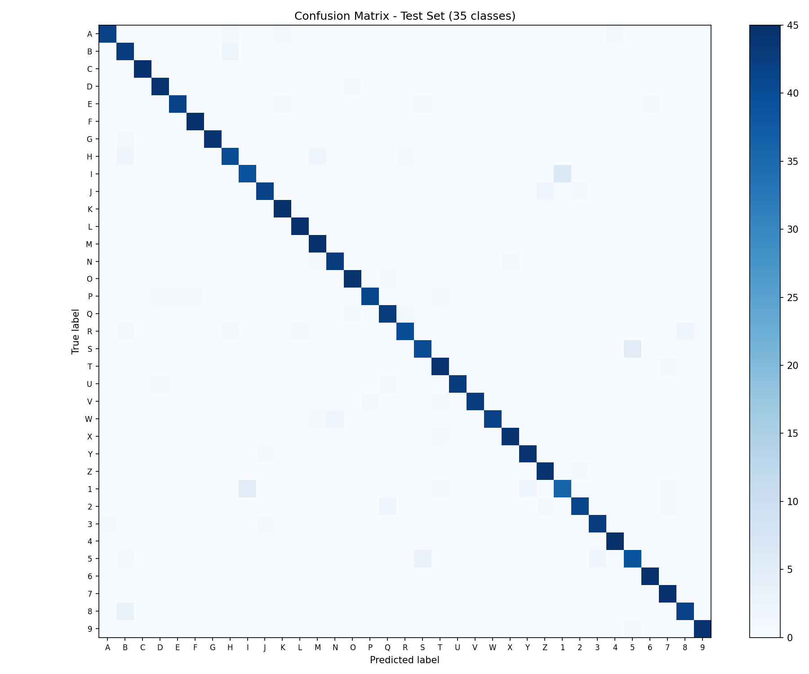

# Character Recognition Neural Network — From Scratch (NumPy)

A fully-connected neural network implemented **entirely from scratch using only NumPy** — no TensorFlow, PyTorch, or Keras — that classifies handwritten-style characters into **35 classes**: uppercase letters `A–Z` and digits `1–9`.

Every core component — forward propagation, ReLU/Tanh activations, softmax, cross-entropy loss, backpropagation, and gradient descent — is implemented manually with explicit matrix math.

## Results

| Metric | Train | Validation | Test |
|---|---|---|---|
| Accuracy | 100.00% | 96.19% | **96.57%** |
| Loss | 0.0007 | 0.1447 | — |

Macro Precision: **0.966** · Macro Recall: **0.966** · Macro F1: **0.966**

<p float="left">
  
  
</p>

## Features

- 📦 **Self-contained dataset generator** — renders A-Z/1-9 across 15 system fonts with randomized rotation, scale, translation, blur, and noise (no external dataset download required)
- 🧠 **NumPy-only neural network** — He/Xavier initialization, configurable ReLU or Tanh hidden activations, numerically-stable softmax, categorical cross-entropy (+ optional L2), manual backprop, mini-batch gradient descent
- 📊 **Full evaluation suite** — per-class precision/recall/F1, a manually-computed 35×35 confusion matrix, and visualized misclassified examples
- 🔁 **Fully reproducible** — every random step is seeded; `python main.py` regenerates the dataset, retrains, and re-evaluates with identical results

## Project Structure

```
char_nn_project/
├── main.py                      # Runs the full pipeline end-to-end
├── src/
│   ├── data_generation.py       # Synthetic character dataset generator
│   ├── preprocessing.py         # Stratified train/val/test split + one-hot encoding
│   ├── neural_network.py        # The from-scratch NumPy neural network
│   ├── train.py                 # Training loop, hyperparameters, curve plots
│   └── evaluate.py               # Test metrics, confusion matrix, error analysis
├── data/                         # Generated dataset (created on first run)
├── outputs/
│   ├── weights/model.npz         # Trained weights
│   ├── plots/                    # Training curves, confusion matrix, samples
│   ├── metrics_summary.txt
│   └── test_metrics.txt
└── report.md                     # Full methodology & analysis write-up
```

## Getting Started

### Requirements

- Python 3.9+
- `numpy`, `pillow`, `matplotlib`

```bash
pip install numpy pillow matplotlib
```

### Run

```bash
git clone <your-repo-url>
cd char_nn_project
python3 main.py
```

This runs every stage in order — data generation → preprocessing → training → evaluation — and populates `data/` and `outputs/`.

To re-train with different hyperparameters without regenerating data:

```bash
python3 src/train.py
```

(edit the constants at the top of `src/train.py` — architecture, learning rate, epochs, batch size)

## Model Architecture

```
Input (784) → Dense(128) → ReLU → Dense(64) → ReLU → Dense(35) → Softmax
```

| Hyperparameter | Value |
|---|---|
| Learning rate | 0.5 |
| L2 regularization | 1e-4 |
| Batch size | 64 |
| Epochs | 60 |
| Optimizer | Mini-batch gradient descent |

## Error Analysis

The model's residual errors cluster almost entirely around genuinely similar-looking character pairs — `B↔8`, `1↔I`, `2↔Z`, `V↔Y`, `R↔H`, `U↔P` — rather than random mistakes, suggesting it has learned meaningful shape features rather than memorizing noise. See [`report.md`](report.md) for the full write-up, including 8 analyzed misclassified examples.

## License

MIT
