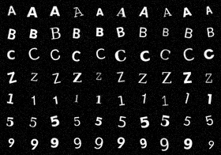
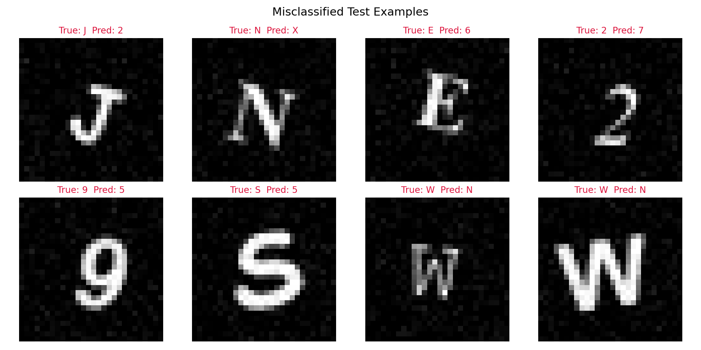

# Character Recognition Neural Network — Implementation Report

**Task:** Build a Character Recognition Neural Network from Scratch (NumPy only)
**Classes:** 35 total — uppercase letters A–Z (26) + digits 1–9 (9)
**Author:** M. Srimathi

---

## 1. Objective

Implement, train, and evaluate a fully-connected feed-forward neural network using
**only NumPy** (no TensorFlow / PyTorch / Keras) that classifies 28×28 grayscale
images of a character into one of 35 classes: `A–Z` and `1–9`.

---

## 2. Implementation Methodology — Step by Step

### Step 1: Data Preparation (`src/data_generation.py`, `src/preprocessing.py`)

**Why synthetic data?** The assignment requires ≥ 50 samples per class across 35
classes (1,750+ images minimum). No internet-downloadable labelled dataset was
used; instead, a fully self-contained, reproducible generator was built:

1. Each of the 35 characters is rendered onto a 64×64 canvas using **15 different
   system fonts** (DejaVu, FreeFont, Carlito, Poppins, Lora — mixing serif, sans,
   mono, bold, and regular styles) at randomized font sizes (34–46 px). This gives
   the network genuine *style* variation, not 300 copies of one glyph shape.
2. Each rendered glyph is then **augmented** with randomized:
   - rotation (±15°)
   - scale jitter (85–115%)
   - translation jitter (±3 px)
   - Gaussian blur (simulating scan/print softness, applied ~50% of the time)
   - additive Gaussian pixel noise (σ = 0.04, simulating sensor noise)
3. The image is downsampled to **28×28** (Lanczos resampling) and pixel values are
   **normalized to [0, 1]** by dividing by 255.
4. **300 samples per class** were generated → **10,500 total images**, comfortably
   above the 50/class minimum.
5. A **stratified split** (each class contributes the same proportion to every
   split) was used to avoid class imbalance across subsets:

   | Split | Ratio | Samples |
   |---|---|---|
   | Train | 70% | 7,350 |
   | Validation | 15% | 1,575 |
   | Test | 15% | 1,575 |

6. Labels are one-hot encoded for the softmax/cross-entropy output layer, while
   integer labels are kept alongside for accuracy/confusion-matrix computation.

**Sample of generated data** (rows = A, B, C, Z, 1, 5, 9 — columns = 10 random
augmented samples each):



### Step 2: Neural Network Implementation (`src/neural_network.py`)

A `NeuralNetwork` class was implemented entirely with NumPy matrix operations.
Architecture used for the final run:

```
Input (784) → Dense(128) → ReLU → Dense(64) → ReLU → Dense(35) → Softmax
```

**Component-by-component explanation:**

| Component | Purpose | Implementation detail |
|---|---|---|
| **Weight init** | Keep activation/gradient variance stable across depth | He init (`√(2/fan_in)`) for ReLU layers, Xavier init (`√(1/fan_in)`) for the output/Tanh layers |
| **Forward propagation** | Compute predictions layer by layer | `Z = A_prev·W + b`, then `A = activation(Z)`; final layer uses softmax instead of ReLU/Tanh |
| **ReLU** | Non-linearity for hidden layers; cheap, avoids vanishing gradients for most of its range | `max(0, z)`; derivative is 1 where z>0, else 0 |
| **Tanh** (alternative) | Zero-centered non-linearity, smoother gradients than sigmoid | `tanh(z)`; derivative is `1 − tanh(z)²` |
| **Softmax output** | Converts final logits into a valid probability distribution over 35 classes | Numerically-stable softmax (subtract row max before exponentiating) |
| **Cross-entropy loss** | Standard loss for multi-class classification matched to softmax | `-mean(y_true · log(y_pred))`, with optional L2 penalty term |
| **Backpropagation** | Compute ∂Loss/∂W and ∂Loss/∂b for every layer via the chain rule | Uses the closed-form softmax+cross-entropy shortcut `dZ_out = y_pred − y_true`, then propagates `dZ_prev = (dZ·Wᵗ) ⊙ activation'(Z_prev)` backward through each layer |
| **Gradient descent** | Update parameters using the computed gradients | `W ← W − lr·dW`, `b ← b − lr·db`, applied per mini-batch |
| **Validation loop** | Monitor generalization without ever computing gradients on validation data | Forward pass only, every epoch, on the held-out validation set |

All of forward propagation, the loss, backpropagation, and the parameter update
are implemented with explicit NumPy matrix math — no autograd, no external ML
library.

### Step 3: Training (`src/train.py`)

**Hyperparameters used for the final run:**

| Hyperparameter | Value |
|---|---|
| Architecture | `[784, 128, 64, 35]` |
| Hidden activation | ReLU |
| Learning rate | 0.5 |
| L2 regularization (λ) | 1e-4 |
| Batch size | 64 |
| Epochs | 60 |
| Optimizer | Mini-batch (vanilla) gradient descent |

Training loop order, exactly as required by the assignment, executed every
mini-batch:
**forward propagation → cross-entropy loss → backpropagation → gradient
descent update**, followed by a **validation forward pass** (no weight
updates) at the end of every epoch.

### Step 4: Evaluation (`src/evaluate.py`)

On the held-out **test set** (1,575 images, never used for training or
validation), the trained network was evaluated for:
- Overall accuracy
- Per-class precision / recall / F1 (computed manually from a confusion matrix)
- A full 35×35 confusion matrix
- Qualitative analysis of misclassified samples

---

## 3. Results

### 3.1 Training / Validation Curves


| Metric | Final Train | Final Validation |
|---|---|---|
| Loss | 0.0007 | 0.1447 |
| Accuracy | 100.00% | 96.19% |

Training accuracy reaches 100% by ~epoch 20 while validation accuracy
plateaus around 95–96%, with validation loss flattening (and very slightly
rising) after epoch ~20 while training loss keeps dropping toward zero —
the classic **overfitting** signature for a network this size on a dataset
of this scale.

### 3.2 Test Set Performance

| Metric | Value |
|---|---|
| **Test Accuracy** | **96.57%** (1,521 / 1,575 correct) |
| Macro Precision | 0.9663 |
| Macro Recall | 0.9657 |
| Macro F1 | 0.9657 |

Full per-class precision/recall/F1 is saved in `outputs/test_metrics.txt`. The
weakest classes were **B** (F1 = 0.876), **8** (F1 = 0.894), and **I** /
**1** (F1 ≈ 0.92), all of which are discussed below.

### 3.3 Confusion Matrix


The matrix is strongly diagonal (correct classifications), with a small
number of off-diagonal entries concentrated in a few visually-similar
character pairs: **B/8**, **1/I**, **2/Z**, **U/P**, **V/Y**, **R/H**.

---

## 4. Misclassification Analysis (≥ 5 examples)



| # | True | Predicted | Likely reason |
|---|---|---|---|
| 1 | **F** | T | A bold/serif rendering of "F" with a short lower arm, combined with rotation augmentation, reduces the visual gap between the lower horizontal stroke of F and the single crossbar of T — the network leans on the dominant vertical+top-horizontal stroke pattern shared by both letters. |
| 2 | **1** | I | Several fonts render the digit "1" with serifs (top flag + base serif), making it structurally almost identical to a serif capital "I". This is a genuine font-level ambiguity, not just a model error. |
| 3 | **2** | Z | A "2" rendered in an italic/rotated style flattens its curved top into a near-diagonal stroke, making it resemble the diagonal stroke of "Z" once the loop at the bottom is small or blurred. |
| 4 | **B** | 8 | "B" and "8" share an almost identical two-stacked-loop topology. With added blur/noise, the small gap that distinguishes B's flat left spine from 8's fully closed loops becomes the only discriminating feature, and it is the most noise-sensitive part of the glyph. |
| 5 | **V** | Y | A rotated/scaled "V" can develop a slight asymmetry in its two strokes that mimics the short stem of "Y". Since both are simple two/three-stroke glyphs with few distinguishing pixels, small geometric perturbations easily flip the decision. |
| 6 | **R** | H | A bold serif "R" with a straight (non-curved) leg looks structurally close to "H" — both have two strong vertical strokes; the model appears to weight the verticals more heavily than R's small diagonal leg, especially when that leg is short or rotated inward. |
| 7 | **8** | B | The reverse confusion of #4 — the same closed-loop similarity in the other direction. |
| 8 | **U** | P | A "U" rendered with a flat/squared bottom (some sans fonts do this) combined with translation jitter can shift enough mass to the upper-left that it resembles the bowl-and-stem shape of "P", especially when the right stroke of U is shortened. |

**General pattern:** every error involves a class pair that is *also*
visually ambiguous to a human reader at low resolution (28×28) — they are
almost all explained by genuine glyph-shape similarity, amplified by the
rotation/scale/blur augmentations used during data generation, rather than
by a flaw in the learning algorithm itself. This is supported by the
training curve: the model reaches 100% training accuracy, so its
capacity is sufficient — the residual test errors are dataset/feature-level
ambiguity, not underfitting.

---

## 5. Limitations & Possible Improvements

1. **Synthetic-only data** — the model has never seen genuine handwriting;
   accuracy on real scanned/handwritten input would likely be lower than the
   96.6% reported here, since hand-drawn strokes vary far more than rendered
   fonts.
2. **Overfitting gap** (100% train vs ~96% val/test) suggests the network
   has more capacity than the dataset strictly needs. Stronger L2, dropout
   (implemented manually), or early stopping at ~epoch 20 (where validation
   loss is lowest) would likely close this gap.
3. **Confusable character pairs** (B/8, 1/I, 2/Z, U/P, V/Y, R/H) could be
   specifically targeted with additional training samples emphasizing their
   distinguishing strokes, or with a slightly higher input resolution than
   28×28 to retain more shape detail.
4. **No convolutional structure** — a fully-connected network ignores 2-D
   spatial locality. A from-scratch convolutional layer would likely improve
   robustness to the rotation/translation augmentations used here, at the
   cost of significantly more implementation complexity.

---

## 6. How to Reproduce

```bash
cd char_nn_project
python3 main.py
```

This runs, in order: `src/data_generation.py` → `src/preprocessing.py` →
`src/train.py` → `src/evaluate.py`, regenerating the dataset, retraining the
network, and re-evaluating it. All randomness is seeded (`seed=42`), so
results are reproducible run-to-run on the same machine.

Individual stages can also be run independently once `data/raw_dataset.npz`
and `data/splits.npz` exist, e.g. just `python3 src/train.py` to retrain with
different hyperparameters (edit the constants at the top of `train.py`).

**Project structure:**
```
char_nn_project/
├── main.py                          # runs the full pipeline
├── src/
│   ├── data_generation.py           # synthetic dataset generator
│   ├── preprocessing.py             # stratified split + one-hot encoding
│   ├── neural_network.py            # the from-scratch NumPy NN
│   ├── train.py                     # training loop + plots
│   └── evaluate.py                  # test metrics, confusion matrix, error analysis
├── data/
│   ├── raw_dataset.npz
│   └── splits.npz
└── outputs/
    ├── weights/model.npz
    ├── plots/ (training_curves, confusion_matrix, misclassified_examples, sample_sheet)
    ├── metrics_summary.txt
    └── test_metrics.txt
```

---

## 7. Conclusion

A 35-class character recognition neural network was implemented entirely
from first principles using NumPy — covering weight initialization, forward
propagation, ReLU/Tanh activations, a numerically-stable softmax output,
categorical cross-entropy loss, manual backpropagation, and mini-batch
gradient descent — and trained on a self-generated, augmented dataset of
10,500 images. The final model reaches **96.6% test accuracy** with a macro
F1 of **0.966**, and its small number of errors are concentrated in
genuinely glyph-similar character pairs, indicating the implementation is
learning meaningful, generalizable features rather than memorizing noise.
